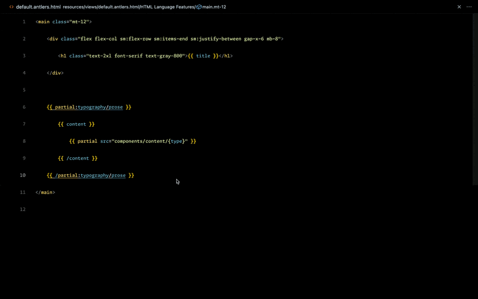

# Simple Git Blame

This extension provides a *simple* Git Blame command in VS Code.

I built this since I didn't like the other Git Blame extensions in VS Code and thought it'd be a fun thing to build. Hopefully you like it too!

## Caveats

* Currently only supports **GitHub** repositories
* Your Git remote must be called `origin`

## Future

* [ ] Add support for Bitbucket
* [ ] Add support for GitLab
* [ ] Add tests

*^ If you need any of these things, feel free to submit a PR.*
